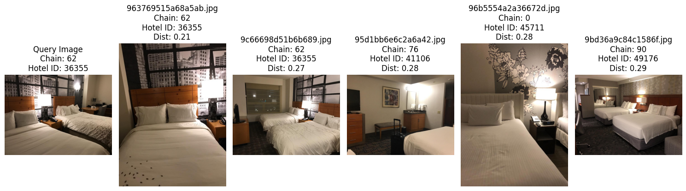
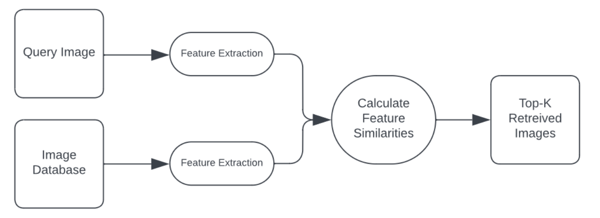
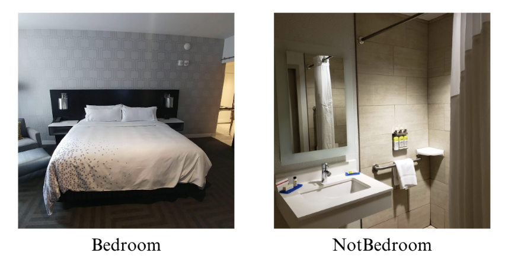

# Computer Vision & Color Based Hotel Geolocation Algorithm 

## Description
This research project was created under the supervision of University of College Dublin's Forensic Computing and Cybercrime Investigation Department. This algorithm was created to extract the color histogram of a query image then calculate and retrieve the images similar in color content from a [97,000+ hotel room image database](https://www.kaggle.com/competitions/hotel-id-to-combat-human-trafficking-2022-fgvc9/data?select=train_images). This repository is strictly intended to be an agglomeration of the most important files from my research project.

    

## Purpose
In human trafficking scenarios, victims are often photographed in hotels. Due to the wide availability of hotel photos on the internet, it is theoretically possible for law enforcement to cross-compare the photograph with online images and pinpoint the location of a victim. However, doing this by hand is virtually impossible. This program automates the process by extracting and comparing the color characteristics of a query image with a database. It provides a starting point for more complex algorithms that will utilize larger databases and more recognition cues. 

## About
**Useful Links:** My research report and a more detailed explanation about the algorithm/its purpose can be found [here](Final_Report.pdf). Additionally, a more generalized color-based image retrieval program can be found [here](https://github.com/pamogbebor/Color-Based_Image_Retrieval_Algorithm).  

**Features:** The program utilizes the color spaces of RGB, HSV, and CIELAB. It also provides color histogram calculations with the euclidean, cosine, chi2, correlation, intersection, and bhattacharyya equations. Through testing, the combination of HSV and bhattacharyya was shown to have the most accurate retrieval rate. 

**Database:** From the Kaggle dataset 'Hotel-ID to Combat Human Trafficking 2022', several thousand images were hand classified into 'Bedroom' or 'NotBedroom'. A classifier was created using Google's Trainable Machine Classifier and performed on the entire dataset. The 46,000 instances of 'Bedroom' became the final database. For the record, there exists a larger dataset called Hotels50K with over 1,000,000 images.

    

